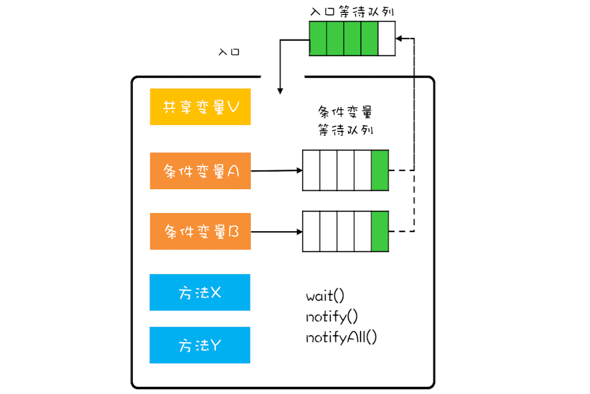

# 核心概念

## 管程的定义

管程是一种同步机制，用于解决并发编程中的同步问题。它是一种高级同步原语，用于实现线程之间的同步和互斥。

## 管程的实现

管程的实现通常使用锁和条件变量来实现。锁用于实现互斥，条件变量用于实现同步。

## 管程的优点

管程的优点是简单易用，性能高，可靠性高。

# 管程模型
## `MESA`模型

MESA(Monitor Extended for Strengthened Access)模型是一种管程模型，用于实现线程之间的同步和互斥。它是一种高级同步原语，用于实现线程之间的同步和互斥。以下为MESA模型示意图

管程要求同一时刻只有一条线程在管程中执行，其他线程必须等待。那当线程T2的操作使线程T1等待的条件满足时，T1和T2究竟谁可以执行

1. 在`Hasen`模型中，要求`notify()`放在代码的最后，这样T2通知完T1后，T2就结束了，然后T1再执行，这样保证了同一时刻只有一个线程执行。
2. `Hoare`模型中，T2通知完T1后，T2阻塞，T1马上执行；等T1执行完，再唤醒T2，也能保证同一时刻只有一个线程执行。但是相比`Hasen`模型，`Hoare`模型需要多一次阻塞唤醒。
3. `MESA`管程模型中，T2通知完T1后，T1还是继续执行，T1并不立即执行，仅仅是从条件变量的等待队列进到入口等待队列中，这样做的好处是`notify()`不用放到代码的最后，T2也没有多余的阻塞唤醒操作，但是也有个副作用，T1再次执行的时候，可能曾经满足的条件已经不满足了，所以需要以循环方式检验条件变量

# 参考代码
[使用管程的方式实现一个线程安全的队列](../java-concurrency/src/main/java/cn/chanze/monitor/BlockQueue.java)

# 参考文献
极客时间《Java并发编程实战》