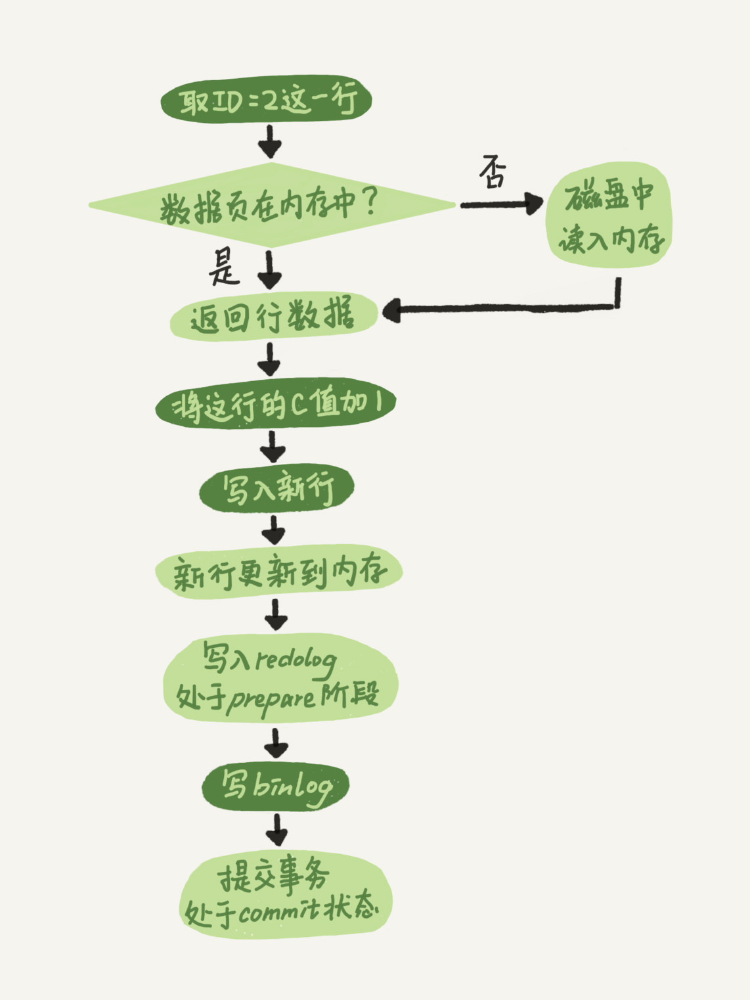

# MySQL日志体系

MySQL的日志体系是保证数据一致性和可恢复性的核心机制。MySQL的重要日志文件主要包括**redo log日志文件**和**binlog日志文件**。

## redo log日志

### 简介

redo log（重做日志）是InnoDB引擎特有的日志文件，属于**引擎层**的日志文件。当一条记录要更新的时候：

1. InnoDB引擎会**先写到redo log日志文件里面**，并更新内存
2. 这个时候就算更新完成了（**WAL技术：Write-Ahead Logging，先写日志再写磁盘**）
3. InnoDB会在适当的时候，将redo log日志文件中的内容刷新到磁盘文件中

### 核心作用

redo log日志文件用于保证**MySQL宕机后，数据可以恢复到宕机前的状态**，实现crash-safe能力。

### redo log的结构


redo log日志文件采用**循环写入**的方式，是一个固定大小的循环队列：

- **两个指针**：
  - **队头指针（write pos）**：指向当前写入的位置
  - **队尾指针（checkpoint）**：指向需要擦除的位置（擦除前会先更新到磁盘）

- **工作原理**：
  - 写redo log时：移动队尾指针（write pos），写入日志内容
  - 刷新到磁盘时：移动队头指针（checkpoint），标记已持久化的位置
  - **队列满**：当队尾指针等于队头-1时，表示队列满了，需要等待checkpoint推进
  - **队列空**：当队尾指针等于队头时，表示队列空了

### redo log的作用机制

> **crash-safe能力**：有了redo log日志文件，InnoDB引擎就可以保证即使数据库异常重启，之前提交的数据也不会丢失。这个过程用到的核心技术就是**WAL（Write-Ahead Logging）技术**，即先写日志，再写磁盘。

**工作流程：**
1. 数据更新时，先写入redo log（顺序写入，性能高）
2. 更新内存中的数据页（Buffer Pool）
3. 后台线程在适当时机将数据页刷新到磁盘
4. 如果MySQL异常重启，读取redo log，重新执行未写入磁盘的更新操作

## binlog日志

### 简介

binlog（二进制日志）是MySQL Server层实现的日志文件，属于**Server层**的日志文件。与redo log（引擎层日志）不同，binlog是MySQL Server层提供的功能。

### 核心作用

binlog日志文件用于：
- **记录数据库的变更操作**（逻辑日志）
- **数据恢复**：可以用于恢复到任意时间点
- **数据同步**：主从复制、数据备份等场景

### binlog与redo log的对比

| 特性 | redo log | binlog |
|-----|----------|--------|
| **所属层次** | InnoDB引擎层 | MySQL Server层 |
| **适用范围** | InnoDB引擎特有 | 所有存储引擎都可以使用 |
| **日志类型** | 物理日志，记录数据页的物理修改 | 逻辑日志，记录SQL语句的原始逻辑 |
| **写入方式** | 循环写入，空间固定会用完 | 追加写入，可以一直追加（需定期清理） |
| **主要用途** | 保证crash-safe，数据恢复 | 数据恢复、主从复制、数据同步 |

**详细说明：**

1. **日志类型差异**：
   - redo log记录的是：**在某个数据页上做了什么修改**（物理日志）
   - binlog记录的是：**语句的原始逻辑**，比如"给ID=2这一行的c字段加1"（逻辑日志）

2. **写入方式差异**：
   - redo log：固定大小的循环队列，空间用完会覆盖（但必须确保已持久化的数据才能被覆盖）
   - binlog：追加写入，文件可以一直增长（需要定期清理或归档）

## 更新语句的执行流程

下面以一条更新语句为例，详细说明执行器和InnoDB引擎是如何协作的：

```sql
UPDATE T SET c = c + 1 WHERE ID = 2;
```

假设表中ID=2这一行的c字段当前值是0。

### 执行步骤

1. **执行器找引擎取数据**：
   - 执行器调用InnoDB引擎接口获取ID=2这一行数据
   - ID是主键，引擎直接用树搜索找到这一行
   - 如果该数据页在内存（Buffer Pool）中，直接返回；否则先从磁盘读入内存，再返回

2. **执行器计算新值**：
   - 执行器拿到引擎返回的行数据（c=0）
   - 执行器计算新值：c = 0 + 1 = 1
   - 得到新的一行数据，调用引擎接口写入

3. **引擎写入内存并记录redo log（prepare阶段）**：
   - 引擎将新数据更新到内存中
   - **同时将这个更新操作记录到redo log里面，此时redo log处于prepare状态**
   - 告知执行器执行完成了，随时可以提交事务

4. **执行器生成binlog**：
   - 执行器生成这个操作的binlog
   - **把binlog写入磁盘**

5. **引擎提交事务（commit阶段）**：
   - 执行器调用引擎的提交事务接口
   - **引擎把刚刚写入的redo log改成提交（commit）状态**
   - 更新完成

### 执行流程图



### 两阶段提交（Two-Phase Commit）

最后三步看上去有点"绕"——将redo log的写入拆成了两个步骤：**prepare** 和 **commit**，这就是**"两阶段提交"（2PC）**。

**为什么需要两阶段提交？** 这保证了redo log和binlog的一致性，是MySQL保证数据一致性的关键机制。

## 数据恢复机制

### 基于binlog的数据恢复

由于binlog会记录所有的逻辑操作，并且采用**"追加写"**的方式，所以恢复数据时，只需要将binlog中的操作重新执行一遍即可。

### 恢复到指定时间点的场景

**场景描述**：某天下午两点发现中午十二点有一次误删表，需要找回数据。

**恢复步骤：**

1. **找到最近的全量备份**：
   - 找到最近的一次全量备份（比如前一天晚上的备份）
   - 从这个备份恢复到临时库

2. **应用binlog**：
   - 从备份的时间点开始，将备份的binlog依次取出
   - 重放到中午误删表之前的那个时刻

3. **提取数据**：
   - 这样临时库就跟误删之前的线上库一致了
   - 可以把表数据从临时库取出来，按需要恢复到线上库去


## 为什么需要两阶段提交？

### 问题背景

从上面的数据恢复场景来看，似乎**只使用了binlog，没有直接使用redo log**。那为什么还需要两阶段提交呢？

由于binlog和redo log是两个独立的逻辑，如果不用两阶段提交，要么就是先写完redo log再写binlog，或者反过来。让我们看看这两种方式会有什么问题。

### 场景分析

假设当前ID=2的行，字段c的值是 0。再假设update语句过程中，在写完第一个日志后，第二个日志还没有写完期间发生了crash，会出现什么情况呢？

#### 情况1：先写redo log，后写binlog

**执行顺序：** redo log（已写）→ binlog（未写）→ crash

**问题：**
- 崩溃恢复后，redo log能够恢复数据，恢复后c=1
- 但是binlog中没有记录这个语句
- 后续使用binlog进行数据备份/恢复时，binlog里没有这条语句
- 如果再次发生宕机，从binlog恢复数据时，恢复出来的数据是c=0
- **最终结果**：数据不一致，恢复出来的数据是错误的

#### 情况2：先写binlog，后写redo log

**执行顺序：** binlog（已写）→ redo log（未写）→ crash

**问题：**
- binlog已经记录了"把c从0改成1"这个操作
- 但redo log还没写，崩溃恢复后这个事务会被判定为无效，c的值仍然是0
- 后续使用binlog恢复数据时，会应用"把c从0改成1"这个操作，c变成1
- **最终结果**：数据不一致，恢复后的数据是c=1，但实际应该是c=0

### 两阶段提交的解决方案

两阶段提交可以很好地解决上述两种"先写redo log或先写binlog可能导致数据不一致"的问题。它的核心就是将redo log的写入分为**prepare**和**commit**两个阶段，并配合binlog的写入，保证binlog和redo log的一致性。

**具体流程：**

1. **Prepare阶段**：写redo log（prepare状态），此时表示即将要提交，但事务还没最终完成
2. **写binlog**：写入binlog，且写入成功
3. **Commit阶段**：把redo log改成提交（commit）状态，标志事务真正提交完成

### 崩溃恢复时的处理机制

#### 场景A：在prepare阶段后，binlog还没写完时发生crash

- 数据库重启恢复时，检查redo log状态
- 发现redo log只有prepare没有commit
- **判定**：这个事务未提交，**不会做数据恢复**
- **结果**：数据保持原状（c=0），binlog也没有该操作记录，**保证一致性**

#### 场景B：写完binlog但redo log还没commit时发生crash

- 数据库重启恢复时，检查redo log状态
- 发现redo log只有prepare没有commit
- **判定**：虽然binlog有记录，但redo log未commit，事务无效
- **恢复机制**：MySQL会检查binlog的完整性
  - 如果binlog完整且有对应的事务记录，但没有commit，MySQL会回滚该事务
- **结果**：数据保持原状（c=0），虽然binlog有记录，但应用binlog恢复时会发现redo log未commit，不会应用该事务，**保证一致性**

### 总结

通过两阶段提交机制，可以保证：

- ✅ **不管在哪一步宕机重启，redo log和binlog都能保持严格的一致性**
- ✅ **数据不会丢失**（crash-safe能力）
- ✅ **数据不会多出来**（避免重复应用binlog）
- ✅ **既保证了crash-safe，也保证了主从复制和备份恢复的一致性**


## 关键要点总结

1. **redo log（重做日志）**：
   - InnoDB引擎层日志，物理日志，循环写入
   - 实现crash-safe能力，保证数据不丢失
   - 采用WAL技术（先写日志再写磁盘）

2. **binlog（二进制日志）**：
   - Server层日志，逻辑日志，追加写入
   - 用于数据恢复、主从复制、数据同步

3. **更新语句执行流程**：
   - 执行器调用引擎 → 引擎写入内存和redo log（prepare） → 执行器写binlog → 引擎commit redo log

4. **两阶段提交**：
   - 核心机制：redo log prepare → binlog写入 → redo log commit
   - 保证redo log和binlog的一致性
   - 确保crash恢复后的数据一致性

5. **数据恢复**：
   - 基于binlog实现时间点恢复
   - 通过两阶段提交保证恢复数据的正确性

## 实践建议

- ✅ 理解redo log和binlog的区别和各自作用
- ✅ 掌握两阶段提交的原理，理解其必要性
- ✅ 定期备份binlog，用于数据恢复
- ✅ 合理配置redo log和binlog的大小和清理策略

---

## 参考资料

- 极客时间《MySQL实战45讲》课程
