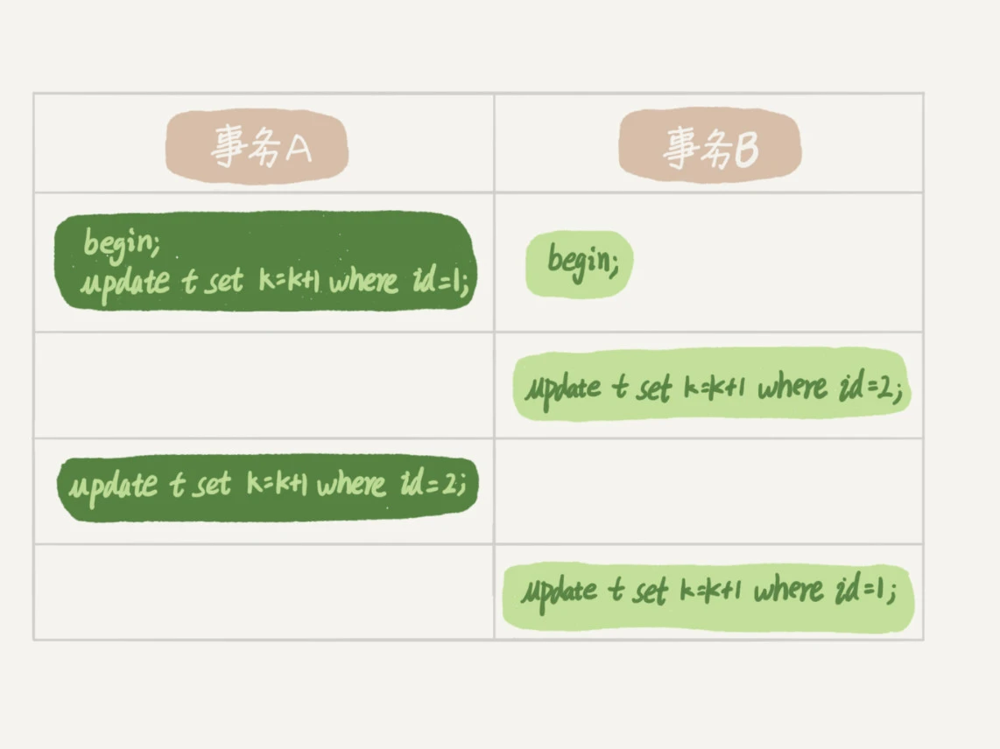

# MySQL 的锁

> 一图速览：锁粒度由大到小为 全局锁 → 表级锁（表锁、MDL） → 行锁。理解加锁对象、阻塞关系与风险点，才能做出正确的取舍与治理。

## 目录
- 锁的全景与使用场景
- 全局锁（FTWRL）
- 表级锁
  - 表锁（LOCK TABLES）
  - 元数据锁（MDL）
- 行锁与两阶段锁
- 死锁与热点场景优化
- 速查清单（Checklist）

## 锁的全景与使用场景

按范围，MySQL 锁分为：全局锁、表级锁、行锁。
- **全局锁**：对整个实例只读，常用于短时逻辑备份。
- **表级锁**：限制表的访问或结构变更，常见于批处理/运维与 DDL 并发治理。
- **行锁（InnoDB）**：最细粒度，保障并发更新的隔离性。

核心目标：在一致性、并发度与运维便利之间做平衡。

## 全局锁（FTWRL）

命令：`FLUSH TABLES WITH READ LOCK`（FTWRL）。效果：实例进入只读态，阻塞 DML、DDL 与事务提交。

使用建议：
- 只用于短窗口备份；务必严格控制持锁时长。
- 备选方案：优先考虑基于快照的备份能力，减少对线上读写的影响。

## 表级锁

表级锁包含两类：显式表锁与元数据锁（MDL）。

### 表锁（LOCK TABLES）

- 语法：`LOCK TABLES ... READ|WRITE;`，配套 `UNLOCK TABLES;`；连接断开也会释放。
- 作用：限定其他会话对目标表的读/写；同时约束当前会话后续能访问的表与访问方式（必须在同一连接内执行）。

示例：
```sql
LOCK TABLES t1 READ, t2 WRITE;
-- 其他会话：写 t1 或 读/写 t2 会被阻塞
-- 当前会话：仅允许 读 t1、读/写 t2；不可写 t1，亦不可访问未锁定的表
```

适用场景：小批量运维/校正操作。对并发冲击大，慎用。

### 元数据锁（MDL, Metadata Lock）

访问表即自动加 MDL，用于保证“表结构与读写”之间的一致性：
- 对表做 DML（增删改查）：加 MDL 读锁。
- 对表做 DDL（结构变更）：加 MDL 写锁。

锁关系：
- 读锁之间不互斥，可并发读写数据。
- 读写锁、写锁之间互斥，保障 DDL 的原子与一致。

风险示意：

1. session A 启动，获取表 t 的 MDL 读锁。
2. session B 获取同表的 MDL 读锁，正常执行（读锁不互斥）。
3. session C 申请 MDL 写锁（执行 DDL），因 A/B 的读锁未释放，被阻塞。
4. session D 再申请 MDL 读锁，也会被 C 的写锁等待所阻塞（形成“堵车”）。

治理建议：
- 清理长事务：长事务会长期占用 MDL 读锁，DDL 应避开或终止异常会话。
- 设置 DDL 超时：对 `ALTER TABLE` 设定等待上限，超时放弃，避免放大阻塞半径。

## 行锁与两阶段锁（InnoDB）

行锁由存储引擎实现，InnoDB 支持行锁，MyISAM 不支持。

含义：针对单行记录的并发更新隔离。例如事务 A 更新 id=1，事务 B 需等待 A 提交或回滚后才能更新同一行。

两阶段锁协议：
- 行锁“按需加锁”，但不“用完即还”，而是统一在事务结束时一次性释放。
- 如果一个事务需要锁多行，应将最可能冲突、影响并发度的行尽量后置，缩短高冲突锁的持有时间。

示意：


## 死锁与热点场景优化

死锁：多事务循环等待彼此持有的锁，导致所有参与者无限等待。



处理策略：
- 超时回退：`innodb_lock_wait_timeout`，超过阈值回退等待（不易精确把控，通常不推荐作为主要手段）。
- 死锁检测：`innodb_deadlock_detect=ON`，发现环路即回滚其中一个事务（推荐）。

热点问题：
在热点行高并发更新下，死锁检测需为每个受阻线程做图检测，CPU 代价显著。

优化思路：
- 业务避险：确保不会出现死锁的访问顺序；在已证明安全的前提下，必要时暂时关闭检测以降低开销（有超时风险，需谨慎评估）。
- 限流与排队：控制同一行的并发更新数，或在中间件/入口层做同键排队；无法中间件治理时，可考虑在进入引擎前按主键排队（较重）。

**小结：**

- MySQL 锁机制分层：全局锁（FTWRL）、表级锁（表锁、元数据锁MDL）、行锁（InnoDB）。
- 表锁与 MDL：DML 加 MDL 读锁、DDL 加 MDL 写锁，写锁与其他锁互斥，需警惕长事务与阻塞风险。
- 行锁：InnoDB 支持，针对单行并发更新，采用两阶段锁协议——锁全部在事务提交时统一释放。
- 死锁：多事务循环等待，可通过死锁检测与超时回退处理。高并发热点需注意检测的性能问题与业务合理排队。
- 优化建议：及时清理长事务，合理安排 DDL 时机，必要时开启或关闭死锁检测，热点并发下采用排队、限流等工程手段。

整体：在事务并发和表结构变更场景下，掌握并合理运用各类锁，可有效保障数据一致性与系统高可用。


