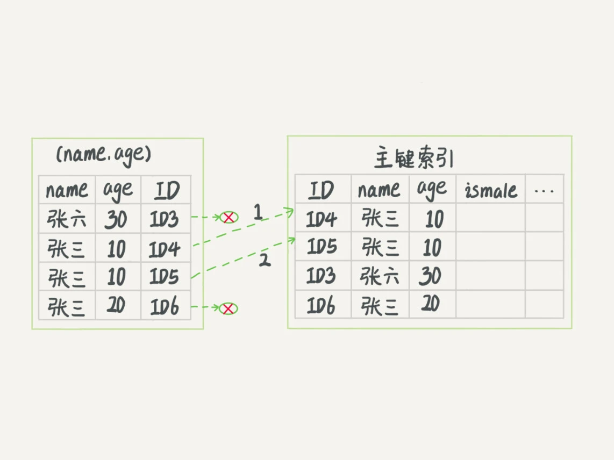

# MySQL索引原理（下）


## 索引回表与覆盖索引

以以下这个表为例，来说明一些MySQL索引的优化技巧

``` bash
mysql> create table T (
ID int primary key,
k int NOT NULL DEFAULT 0, 
s varchar(16) NOT NULL DEFAULT '',
index k(k))
engine=InnoDB;

insert into T values(100,1, 'aa'),(200,2,'bb'),(300,3,'cc'),(500,5,'ee'),(600,6,'ff'),(700,7,'gg');

```


现在如果要执行`select * from T where k between 3 and 5`，需要执行几次树的搜索操作，会扫描多少行？
执行流程如下：
1. 在k索引树上找到k=3的记录，取得ID=300；
2. 在ID索引树上找到ID=300的记录，取得R3`ID=300，k=3，s='cc'`；
3. 在k索引树上取下一个值k=5的记录，取得ID=500；
4. 再回到ID索引树查到ID=500对应的R4，从而得到整行数据`ID=500，k=5，s='ee'`；
5. 在k索引树取下一个值k=6的记录，不满足条件，所以循环结束。

**回到主键索引树搜索的过程，称之为回表**，整个过程查询了k索引树3次，回表了2次。那么是否可以通过索引优化，避免回表过程呢？

## 覆盖索引
如果执行的语句是`select ID from T where k between 3 and 5`，这时只需要查询k索引树，而无需回表。这个过程，只扫描了k索引树。因为ID的值已经在k索引树上了，因此可以直接提供查询结果，不需要回表；**索引k覆盖了我们的查询需求，称之为覆盖索引**。

**由于覆盖索引可以减少树的搜索次数，显著提升查询性能，所以使用覆盖索引是一个常用的性能优化手段。**

### 实例分析：是否有必要将身份证号和名字建立联合索引？

考虑下面的实际业务场景：

``` sql
CREATE TABLE `tuser` (
  `id` int(11) NOT NULL,
  `id_card` varchar(32) DEFAULT NULL,
  `name` varchar(32) DEFAULT NULL,
  `age` int(11) DEFAULT NULL,
  `ismale` tinyint(1) DEFAULT NULL,
  PRIMARY KEY (`id`),
  KEY `id_card` (`id_card`),
  KEY `name_age` (`name`,`age`)
) ENGINE=InnoDB

```

**问题分析：**
- 身份证号是唯一标识，单独的身份证号索引已经足够支持ID查询
- 如果再建立(身份证号、姓名)的联合索引，是否会浪费空间？

**结论：需要根据实际业务场景决定**

如果有一个**高频请求**：根据身份证号查询姓名，那么这个联合索引就非常有意义了。因为：
- 可以在高频请求上使用**覆盖索引**
- 不再需要**回表**查整行记录
- 显著减少语句的执行时间

**实践建议**：定期查询的字段值得考虑建立联合索引，以利用覆盖索引优化性能。

## 最左前缀原则

以(name,age)这个联合索引来分析和说明**最左前缀原则**。


### 核心原理

索引项是按照索引定义里面出现的字段顺序排序的。

### 使用场景

1. **精确匹配姓名**：`WHERE name = '张三'`
   - 可以快速定位到ID4，然后向后遍历得到所有需要的结果
   - 使用索引最左字段

2. **前缀匹配姓名**：`WHERE name LIKE '张%'`
   - 也能用上索引，查找到第一个符合条件的记录是ID3
   - 向后遍历，直到不满足条件为止
   - 使用索引最左字段的左边部分字符

3. **联合字段查询**：`WHERE name = '张三' AND age = 18`
   - 使用联合索引的全部字段
   - 查询效率最高

### 应用原则

**只要满足最左前缀，索引就可以加速检索**

- 最左前缀可以是联合索引的**最左N个字段**
- 也可以是字符串索引的**最左M个字符**

### 实践建议

**如果某个字段高频用于查询，建立联合索引时应优先放在最前面。**

## 索引下推（Index Condition Pushdown, ICP）

### 业务场景

如果有一个需求：检索出表中名字第一个字是"张"，而且年龄是10岁的所有男孩。

```sql
WHERE name LIKE '张%' AND age = 10 AND ismale = 1
```

### 没有索引下推的问题

由于最左前缀原则，这个语句在搜索索引树时：
- 只能使用`name LIKE '张%'`索引
- 找到第一个满足条件的记录ID=3
- 然后遍历所有以"张"开头的记录

**MySQL 5.6之前**：只能从ID3开始一个个回表，到主键索引上找出数据行，再对比字段值。

### 索引下推优化

MySQL 5.6引入了**索引下推优化（Index Condition Pushdown, ICP）**：
- 可以在索引遍历过程中，对索引中包含的字段先做判断
- 直接过滤掉不满足条件的记录
- **显著减少回表次数**，提升查询性能


### 工作原理对比

**无索引下推的执行流程**：


**有索引下推的执行流程**：


**关键改进**：
- 有索引下推优化之后，InnoDB在索引内部就判断了`age`是否等于10
- 对于不等于10的记录，直接判断并跳过
- **大幅减少回表次数**，特别是对于范围查询场景

## 建立联合索引的技巧

### 核心原则

**当已经有了(a,b)这样的联合索引后，一般不需要单独在a上建立索引。**

因此，**如果可以通过调整顺序，少维护一个索引，那么这个顺序往往就是需要优先考虑采用的。**

### 设计建议

1. **评估查询频率**：将最高频查询的字段放在联合索引最前面
2. **减少索引数量**：优先建立联合索引而非多个单列索引
3. **考虑最左前缀**：确保常见的查询模式能利用索引的最左前缀
4. **平衡空间与性能**：联合索引会占用更多空间，需要权衡

## 关键要点总结

本章主要内容总结如下：

1. **索引回表与覆盖索引**
   - 回表：基于非主键索引查询需要先查索引树再查主键索引树
   - 覆盖索引：索引覆盖了查询需求，避免回表，显著提升性能
   - 应根据实际业务场景考虑建立覆盖索引

2. **最左前缀原则**
   - 联合索引可以支持最左前缀的单列及多列查询
   - 只要满足最左前缀，索引就能加速检索
   - 合理设计索引字段顺序，高频查询字段优先

3. **索引下推优化（ICP）**
   - MySQL 5.6引入的优化机制
   - 在索引遍历时提前过滤不满足条件的记录
   - 减少不必要的回表操作，提升范围查询性能

4. **联合索引设计最佳实践**
   - 评估查询频率，设计合理的索引结构
   - 避免冗余索引，节省存储空间
   - 结合业务场景和查询特点优化索引设计

## 实践建议

- ✅ 定期评估查询模式，优化索引设计
- ✅ 充分利用覆盖索引减少回表
- ✅ 合理利用最左前缀原则
- ✅ 根据MySQL版本启用索引下推优化
- ✅ 监控索引使用情况，及时调整

---

## 相关阅读

- [MySQL索引原理（上）](./MySQL索引原理（上）.md) - 索引基础、B+树、主键选择
- [MySQL日志体系](../MySQL日志体系/mysql日志体系.md) - redo log、binlog、undo log详解
- [事务隔离](../事务隔离/事务隔离.md) - MVCC机制实现原理

## 参考资料

- 极客时间《MySQL实战45讲》课程
- [MySQL官方文档 - 索引优化](https://dev.mysql.com/doc/refman/8.0/en/optimization-indexes.html)


