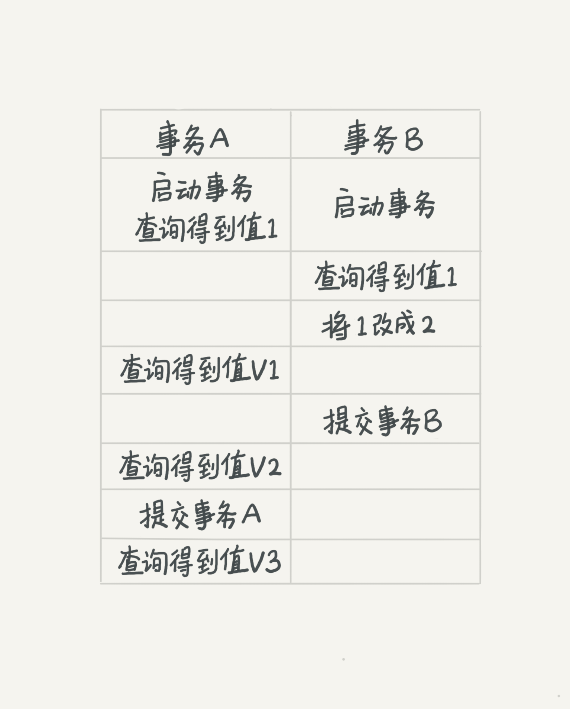

# 事务隔离

## 事务的基本要素（ACID）

ACID是数据库事务的四个基本特性，确保事务的正确执行：

- **Atomicity（原子性）**：事务中的所有操作要么全部成功，要么全部失败，不存在部分成功的情况
- **Consistency（一致性）**：事务执行前后，数据库的状态保持一致，不会破坏数据库的完整性约束
- **Isolation（隔离性）**：多个并发事务之间的操作互不干扰，每个事务都感觉不到其他事务的存在
- **Durability（持久性）**：事务一旦提交，其对数据库的修改就是永久性的，即使系统崩溃也不会丢失

## 事务的隔离级别

MySQL提供了四种事务隔离级别，从低到高分别为：

- **读未提交（Read Uncommitted）**：一个事务未提交时，所做的变更就能被其他事务看到。这是最低的隔离级别，存在脏读、不可重复读和幻读问题
- **读已提交（Read Committed）**：一个事务提交后，所做的变更才能被其他事务看到。解决了脏读问题，但仍存在不可重复读和幻读问题
- **可重复读（Repeatable Read）**：一个事务执行过程中，总是跟这个事务在启动时看到的数据保持一致。在可重复读隔离级别下，未提交的变更对其他事务也是不可见的。解决了脏读和不可重复读问题，但仍可能存在幻读问题（MySQL的InnoDB引擎通过Next-Key Lock解决了幻读问题）
- **串行化（Serializable）**：最高隔离级别，事务串行执行，读写都会加锁，后访问的事务必须等前一个事务执行完成后，才能继续执行。虽然能解决所有并发问题，但性能最低，实际应用中较少使用

## 不同隔离级别的实际效果示例

为了更好地理解不同隔离级别的区别，下面通过一个具体示例来说明：



假设表中有一条记录，字段值为 1。事务A和事务B的执行顺序如上图所示。

看看在不同隔离级别下，事务A在三个时间点看到的V1、V2、V3的值分别是什么：

| 隔离级别 | V1（事务A开始时） | V2（事务B提交后，事务A中） | V3（事务A提交后） |
|---------|-----------------|------------------------|-----------------|
| **读未提交** | 2 | 2 | 2 |
| **读已提交** | 1 | 2 | 2 |
| **可重复读** | 1 | 1 | 2 |
| **串行化** | 1 | 1 | 2 |

**详细说明：**

- **读未提交**：V1的值是 2。事务B虽然还没有提交，但结果已经被A看到了（脏读）。因此，V2、V3也都是 2
- **读已提交**：V1是 1，V2的值是 2。事务B的更新在提交后才能被A看到，所以V3的值也是 2
- **可重复读**：V1、V2是 1，V3是 2。V2仍然是 1，遵循事务在执行期间看到的数据前后必须一致的原则
- **串行化**：在事务B执行"将 1 改成 2"的时候，会被锁住。直到事务A提交后，事务B才可以继续执行。所以从A的角度看，V1、V2值是 1，V3的值是 2

## 数据库如何实现事务隔离

> **提示**：事务隔离的实现机制涉及MVCC（多版本并发控制），这是MySQL InnoDB引擎实现事务隔离的核心技术

在实现上，数据库会创建一个视图（read-view），访问的时候以视图的逻辑结果为准。不同隔离级别的区别主要是创建视图的时机不同：

| 隔离级别 | 视图创建时机 | 实现方式 |
|---------|------------|---------|
| **可重复读** | 事务开始时创建 | 整个事务过程中使用同一个视图，保证看到的数据一致 |
| **读已提交** | 每个SQL语句执行时创建 | 每个SQL语句开始时创建新的视图，能看到已提交的最新数据 |
| **读未提交** | 无视图 | 直接返回记录上的最新值，不创建视图 |
| **串行化** | 无视图 | 直接加读写锁来避免并行访问，保证串行执行 |

## MVCC实现原理（以"可重复读"为例）

MySQL InnoDB引擎通过**MVCC（多版本并发控制）**机制来实现事务隔离。下面以"可重复读"隔离级别为例，详细说明实现原理。

### 核心机制

在MySQL中，实际上每条记录在更新的时候都会同时记录一条回滚操作。记录上的最新值，通过回滚操作，都可以得到前一个状态的值。

### 实例说明

假设一个值从1被按顺序改成了2、3、4，在回滚日志（undo log）里面就会有类似下面的记录：


### 多版本并发控制（MVCC）

当前值是 4，但是在查询这条记录的时候，不同时刻启动的事务会有不同的read-view。如图中看到的，在视图A、B、C里面，这一条记录的值分别是1、2、4，**同一条记录在系统中可以存在多个版本**，这就是数据库的多版本并发控制（MVCC）。

对于read-view A，要得到1，就必须将当前值依次执行图中所有的回滚操作得到。

### 并发处理

即使现在有个另外的事务正在将4改成5，这个事务跟read-view A、B、C对应的事务是不会冲突的。因为：

- 写操作会创建新的版本
- 读操作会基于事务开始时的read-view读取对应的版本
- 读写操作不会相互阻塞（读写分离）

### 回滚日志的清理

回滚日志是会被删除的，系统会判断，当没有事务在需要用到这些回滚日志时，回滚日志会被删除。即：**系统中没有比这个回滚日志更早的read-view时，回滚日志会被删除**。

> **⚠️ 重要提示：避免长事务**  
> 长事务意味着系统里面会存在很老的事务视图。由于这些事务随时可能访问数据库里面的任何数据，所以这个事务提交之前，数据库里面它可能用到的回滚记录都必须保留，这就会导致大量占用存储空间。因此，在生产环境中应该尽量避免长事务。

## 事务的启动方式

MySQL中，事务的启动方式有两种：

### 1. 显式启动事务

使用 `begin` 或 `start transaction` 显式启动事务：
- 配套的提交语句：`commit`
- 配套的回滚语句：`rollback`

```sql
-- 方式1：使用 begin
BEGIN;
SELECT * FROM user WHERE id = 1;
UPDATE user SET name = 'new_name' WHERE id = 1;
COMMIT;

-- 方式2：使用 start transaction
START TRANSACTION;
SELECT * FROM user WHERE id = 1;
UPDATE user SET name = 'new_name' WHERE id = 1;
COMMIT;
```

### 2. 关闭自动提交（autocommit）

执行 `set autocommit=0`，这个命令会将当前线程的自动提交关掉：
- 执行一个 `SELECT` 语句，事务就启动了
- 事务不会自动提交
- 事务持续存在直到主动执行 `commit` 或 `rollback` 语句，或者断开连接

```sql
-- 关闭自动提交
SET autocommit = 0;

-- 后续所有SQL都在这个事务中
SELECT * FROM user WHERE id = 1;
UPDATE user SET name = 'new_name' WHERE id = 1;
COMMIT;  -- 或 ROLLBACK;
```

### ⚠️ 注意事项

**避免意外的长事务：**  
有些客户端连接框架会默认连接成功后执行一个 `set autocommit=0` 命令。这就导致了接下来的查询都在事务中，如果是长连接，就导致了意外的长事务。建议在需要的时候显式启动事务，并在使用完毕后及时提交或回滚。

## 关键要点总结

1. **ACID特性**：事务的四个基本特性，确保数据的一致性和可靠性
2. **隔离级别**：MySQL提供四种隔离级别，从低到高，性能和一致性需要权衡
3. **MVCC机制**：MySQL通过多版本并发控制实现事务隔离，无需加锁即可实现一致性读
4. **视图机制**：不同隔离级别通过在不同时机创建视图来实现
5. **回滚日志**：undo log记录数据的历史版本，支持MVCC和事务回滚
6. **长事务风险**：长事务会占用大量存储空间，应该尽量避免

## 实践建议

- ✅ 优先使用 `begin/commit` 显式控制事务
- ✅ 避免使用 `set autocommit=0`，特别是在长连接场景
- ✅ 避免长事务，及时提交或回滚
- ✅ 根据业务需求选择合适的隔离级别（MySQL默认是可重复读）

---

## 参考资料

- 极客时间《MySQL实战45讲》课程