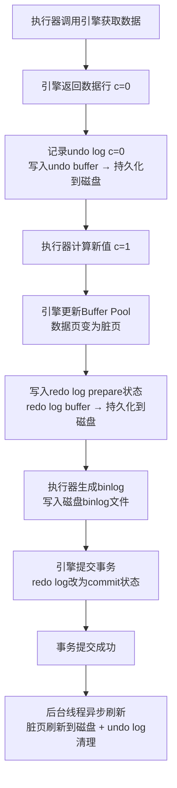

# 从MySQL日志的角度理解更新语句执行流程

## 概述

本文档以 `UPDATE T SET c = c + 1 WHERE ID = 2;` 为例（假设ID=2这一行的c字段当前值是0），详细讲解更新语句的执行流程以及各步骤的容错机制。

---

## 一、更新语句执行过程中日志文件的更新流程

### 1.1 完整执行步骤

#### 步骤1：执行器获取数据
- **操作**：执行器调用InnoDB引擎接口获取ID=2这一行
- **查找方式**：InnoDB通过主键索引（B+树）查找
- **数据来源**：
  - 若数据页在Buffer Pool中直接返回
  - 否则从磁盘读取到Buffer Pool，再返回

#### 步骤2：记录undo log（数据更新前）
- **操作**：记录更新前的旧值到undo log
- **记录内容**：
  - RowID
  - 事务ID（trx_id）
  - 回滚指针（roll_pointer）
  - 旧值（c=0）
- **写入流程**：写入到undo buffer → 持久化到磁盘的undo log文件
- **作用**：支持回滚和MVCC

#### 步骤3：执行器计算新值并调用引擎写入
- **操作**：执行器计算新值：`c = 0 + 1 = 1`
- **调用**：执行器调用引擎接口写入新数据

#### 步骤4：引擎更新Buffer Pool
- **操作**：将新数据（c=1）更新到Buffer Pool中的数据页
- **状态**：此时数据页变为脏页（dirty page），稍后由后台线程刷新到磁盘

#### 步骤5：写入redo log（prepare阶段）
- **操作**：将更新操作写入redo log
  - redo log是**物理日志**，记录数据页的修改
- **写入流程**：写入redo log buffer → 持久化到磁盘的redo log文件
- **状态**：此时redo log处于**prepare状态**
- **技术**：使用WAL技术（Write-Ahead Logging）- 先写日志，后写数据

#### 步骤6：执行器生成并写入binlog
- **操作**：生成该操作的binlog
  - binlog是**逻辑日志**，记录SQL逻辑
- **写入**：将binlog写入磁盘

#### 步骤7：提交事务（commit阶段）
- **操作**：执行器调用引擎的提交接口
- **状态变更**：引擎把redo log从prepare改为**commit状态**
- **结果**：更新完成，事务提交成功

#### 步骤8：后台线程异步刷新
- **Checkpoint机制**：将脏页从Buffer Pool刷新到磁盘
- **Purge线程**：清理不再需要的undo log

### 1.2 完整流程图

### 1.3 关键日志文件说明

| 日志类型 | 日志性质 | 记录内容 | 主要作用 |
|---------|---------|---------|---------|
| **undo log** | 逻辑日志 | 更新前的旧值 | 支持事务回滚、MVCC多版本控制 |
| **redo log** | 物理日志 | 数据页的物理修改 | 保证crash-safe，异常恢复 |
| **binlog** | 逻辑日志 | SQL语句的逻辑操作 | 主从复制、数据恢复 |

---

## 二、每一步宕机/异常的容错机制

### 2.1 关键容错机制

MySQL通过以下机制保证数据完整性和一致性：

1. **两阶段提交（2PC）**：确保redo log与binlog的一致性
2. **WAL（Write-Ahead Logging）**：先写日志，后写数据，保证持久化
3. **redo log的prepare/commit状态**：区分事务状态，支持崩溃恢复
4. **undo log的回滚能力**：支持事务回滚，保证原子性
5. **binlog完整性检查**：在崩溃恢复时检查binlog完整性，决定提交或回滚

### 2.2 各步骤的宕机恢复策略

#### 宕机点1：步骤1-2之间（获取数据后，undo log未写入）

**情况**：事务未开始，或undo log未写入

**恢复策略**：
- 事务视为未开始，无影响
- 数据完整性保证：c=0（未修改）

---

#### 宕机点2：步骤2-3之间（undo log已写，但未开始修改数据）

**情况**：undo log已写入，数据页未修改

**恢复策略**：
- redo log中没有该事务的prepare记录
- 事务被视为未提交，自动回滚
- 利用undo log回滚（如果有部分写入）

**恢复结果**：数据完整性保证：c=0（未修改）

---

#### 宕机点3：步骤3-5之间（Buffer Pool已更新，redo log未写或未prepare）

**情况**：Buffer Pool中数据页已更新，redo log未写入或未完成prepare

**恢复策略**：
- 崩溃恢复时检查redo log
- 没有prepare记录，说明事务未提交
- Buffer Pool丢失，但从磁盘读取的数据仍是旧值（c=0）
- 利用undo log回滚（如果有残留状态）

**恢复结果**：数据完整性保证：c=0（未修改）

---

#### 宕机点4：redo log prepare后、binlog写入前 ⚠️ **关键点**

**情况**：redo log处于prepare状态，binlog未写入

**恢复机制**（两阶段提交的第一个检查点）：
1. 崩溃恢复时检查redo log状态
2. 发现redo log是prepare，但没有对应的binlog记录
3. **判定**：事务未提交成功
4. **执行回滚**：使用undo log回滚，Buffer Pool中的数据页恢复
5. 磁盘数据未修改，无需额外操作

**恢复结果**：
- ✅ 数据完整性保证：c=0（未修改）
- ✅ redo log和binlog一致性保证：两个日志都没有该操作
- ✅ 可以安全地忽略该事务

---

#### 宕机点5：binlog写入后、redo log commit前 ⚠️ **关键点**

**情况**：redo log处于prepare状态，binlog已完整写入

**恢复机制**（两阶段提交的第二个检查点）：
1. 崩溃恢复时检查redo log状态
2. 发现redo log是prepare，但binlog中已有完整记录
3. **判定**：binlog已写入，说明事务应该被提交
4. **自动提交**：将redo log从prepare改为commit状态
5. **恢复数据**：使用redo log恢复Buffer Pool中的数据页（c=1）
6. 后续从binlog恢复时数据一致

**恢复结果**：
- ✅ 数据完整性保证：c=1（正确提交）
- ✅ redo log和binlog一致性保证：两个日志都记录了该操作
- ✅ 崩溃恢复后数据自动恢复

---

#### 宕机点6：redo log commit后、数据页刷新前

**情况**：redo log已commit，但数据页还在Buffer Pool，未刷新到磁盘

**恢复机制**：
1. 崩溃恢复时读取redo log
2. 发现redo log是commit状态
3. **使用redo log恢复**：重新执行所有commit的redo log记录
4. 恢复Buffer Pool中的数据页（c=1）
5. 脏页会被后台线程刷新到磁盘

**恢复结果**：
- ✅ 数据完整性保证：c=1（已提交的数据不丢失）
- ✅ crash-safe能力：即使数据页未写入磁盘，也能恢复

---

#### 宕机点7：数据页已刷新到磁盘后

**情况**：所有日志已写入，数据页已刷新到磁盘

**恢复策略**：无需额外恢复，数据已持久化

**恢复结果**：数据完整性保证：c=1

### 2.3 两阶段提交的作用总结

| 宕机时机 | redo log状态 | binlog状态 | 恢复策略 | 最终数据状态 |
|---------|------------|-----------|---------|------------|
| redo log prepare前 | 无 | 无 | 回滚事务 | c=0（未修改） |
| binlog写入前 | prepare | 无 | 回滚事务 | c=0（未修改） |
| binlog写入后、commit前 | prepare | 有 | **自动提交**事务 | c=1（已提交） |
| commit后 | commit | 有 | 使用redo log恢复数据 | c=1（已提交） |

**核心原理**：
- 如果binlog没有写，说明事务不应该提交，回滚
- 如果binlog已写，说明事务应该提交，将redo log改为commit并恢复数据

### 2.4 容错机制的核心要点

| 机制 | 作用 | 保证 |
|-----|------|------|
| **WAL（Write-Ahead Logging）** | 先写日志，再写磁盘 | 即使数据页未落盘也能恢复 |
| **两阶段提交（2PC）** | 确保redo log与binlog的一致性 | 避免日志不一致导致的恢复问题 |
| **undo log** | 未提交事务可回滚 | 保证事务原子性 |
| **redo log** | 记录已提交事务的数据修改 | 保证crash-safe能力 |
| **binlog完整性检查** | 崩溃恢复时检查binlog完整性 | 决定事务是否提交或回滚 |

---

## 三、关键保证总结

### 3.1 数据完整性保证

- ✅ **数据完整性**：无论在哪一步宕机，数据不会损坏或出现中间状态
- ✅ **数据准确性**：已提交的事务不丢失，未提交的事务不影响数据
- ✅ **日志一致性**：redo log与binlog通过两阶段提交保持一致
- ✅ **事务原子性**：事务要么完全成功，要么完全回滚，无中间状态
- ✅ **crash-safe能力**：即使异常重启，已提交的数据也能恢复

### 3.2 设计思想

1. **先写日志，后写数据**（WAL）：保证即使数据未落盘，也能通过日志恢复
2. **两阶段提交**：确保多个日志的一致性，避免不一致恢复
3. **日志分离**：不同日志承担不同职责（undo log回滚、redo log恢复、binlog复制）
4. **异步刷新**：提高性能，通过日志保证数据不丢失

---

## 结论

以上机制共同保证了MySQL在异常情况下的数据完整性与准确性，确保：
- 已提交的事务数据不丢失
- 未提交的事务不影响数据
- 日志文件保持一致
- 系统具备crash-safe能力

---

## 相关阅读

- [事务隔离](../事务隔离/事务隔离.md) - ACID特性、MVCC机制详解
- [MySQL日志体系](../MySQL日志体系/mysql日志体系.md) - redo log、binlog、undo log深入分析
- [MySQL索引原理](../MySQL索引原理/MySQL索引原理（上）.md) - B+树索引结构
- [MySQL索引原理（下）](../MySQL索引原理/MySQL索引原理（下）.md) - 索引优化实践

## 参考资料

- 极客时间《MySQL实战45讲》课程